# StreamSim Architectural Diagram

This diagram reflects the current runtime architecture and control flow, including onboarding/readiness gates, secret management, Deepgram intelligence enrichment, hybrid inference routing, anti-echo/glaze shaping, and TTS deafen safeguards.

```mermaid
flowchart LR
  %% ===== Client surfaces =====
  subgraph CLIENT[Client Surfaces]
    controlUI["Control Center UI<br/>index.html + app.js"]
    overlayUI["Overlay UI<br/>overlay.html + overlay.js"]
  end

  %% ===== API + policy =====
  subgraph API[API and Policy Layer]
    server["Express Server<br/>src/server.ts"]
    configStore["ConfigStore + RuntimeConfig<br/>load/merge/save"]
    compliance["Compliance Gate + Logger<br/>EULA reconcile + audit events"]
    readiness["Readiness Checks<br/>startup blockers + diagnostics"]
    bootDiag["Boot Diagnostics<br/>hardware profile + tier recommendation"]
    secrets["SecretStore<br/>cloud/deepgram keychain"]
    banDiag["Banlist Diagnostics<br/>banlist health/reporting"]
  end

  %% ===== Capture and context =====
  subgraph CAPTURE[Capture, STT, Vision, Intelligence]
    captureProvider["Capture Provider Router<br/>mock | device | endpoint"]
    sttEngine["STT Engine<br/>mock/local/deepgram/openai"]
    devicePipeline["DeviceCapturePipeline<br/>rolling transcript + tone + vision"]
    dgIntel["Deepgram Intelligence Mapper<br/>sentiment/intents/topics -> vibe"]
    contextAssembler["Context Assembler"]
    promptBuilder["Prompt Builder"]
  end

  %% ===== Orchestration =====
  subgraph ORCH[Simulation Orchestration]
    orchestrator["SimulationOrchestrator<br/>loop, status, fallback"]
    sidecar["SidecarManager<br/>install/start/pull/resume/cancel"]
    observability["ObservabilityLogger<br/>tick, malformed, recovery metrics"]
  end

  %% ===== Inference =====
  subgraph INFER[Hybrid Inference Plane]
    providerFactory["Provider Factory"]
    hybridProvider["HybridInferenceProvider<br/>validate + health + retry"]
    localLLM[("Local Inference<br/>Ollama / LM Studio")]
    cloudLLM[("Cloud Inference<br/>OpenAI / Groq")]
    fallbackMock[("Fallback Mock Provider")]
    parser["Output Parser<br/>JSON parse + malformed classification"]
  end

  %% ===== Post-processing + delivery =====
  subgraph DELIVERY[Safety, Identity, Spooling, TTS]
    antiEcho["Anti-Echo + Read-Chat Rewriter"]
    antiGlaze["Diversity and Anti-Glaze Rules"]
    safetyFilter["Safety Filter<br/>drop policy + banlist checks"]
    identityMgr["Identity Manager<br/>safe username assignment"]
    spooler["Spooling Engine<br/>Poisson jitter + pacing"]
    ttsService["TextToSpeechService<br/>OpenAI / Deepgram Aura"]
    audioState["AudioStateManager<br/>deafen / watchdog reset"]
    sse["SSE Stream<br/>messages + meta + watermark"]
  end

  %% ===== Primary API/control flow =====
  controlUI -->|config/start/stop/onboarding/secrets| server
  server --> configStore
  server --> compliance
  server --> readiness
  server --> bootDiag
  server --> secrets
  server --> banDiag

  %% ===== Runtime loop =====
  server --> orchestrator
  orchestrator --> sidecar
  orchestrator --> captureProvider
  captureProvider --> sttEngine
  captureProvider --> devicePipeline
  captureProvider --> dgIntel
  dgIntel --> devicePipeline
  devicePipeline --> contextAssembler
  contextAssembler --> promptBuilder
  promptBuilder --> providerFactory
  providerFactory --> hybridProvider

  hybridProvider --> localLLM
  hybridProvider --> cloudLLM
  hybridProvider -. provider failure .-> fallbackMock

  localLLM --> parser
  cloudLLM --> parser
  fallbackMock --> parser

  parser --> antiEcho
  antiEcho --> antiGlaze
  antiGlaze --> safetyFilter
  safetyFilter --> identityMgr
  identityMgr --> spooler
  spooler --> sse
  sse --> overlayUI

  %% ===== TTS / anti-loop =====
  spooler --> ttsService
  ttsService --> audioState
  audioState -. pause/resume STT .-> sttEngine
  audioState --> orchestrator

  %% ===== Observability =====
  orchestrator --> observability
  observability --> sse
  server --> sse
```

## Current behavior represented

1. **Start is gated** by EULA state, readiness checks, and required cloud/deepgram keys before `SimulationOrchestrator.start()` can run.
2. **Capture is provider-routed** (`mock`, `device`, or endpoint polling), with Deepgram intelligence mapped into vibe/topic/intent fields when Deepgram STT data is present.
3. **Inference is hybrid and resilient**: validation + health checks + retry hooks on the primary provider, with mock fallback when provider generation fails.
4. **Post-inference shaping** applies anti-echo/read-chat rewrite, anti-glaze diversity normalization, safety filtering, identity assignment, and paced spooling.
5. **TTS anti-loop protection** pauses STT during playback and uses watchdog reset paths to prevent stale deafen state.
