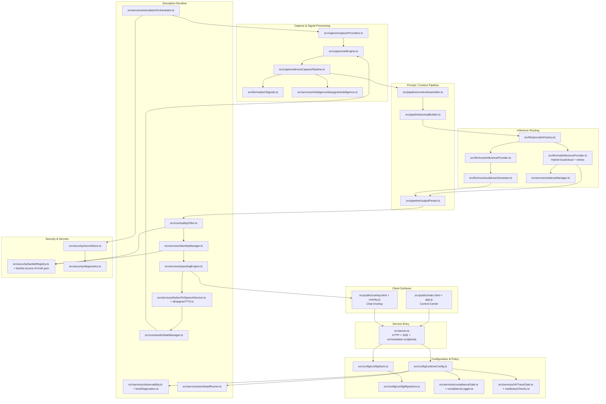

# StreamSim System Component Map

The component map below groups concrete code modules into execution domains and shows how responsibilities are partitioned.

## Legend

- **Simulation Runtime**: Real-time control loop and post-inference shaping.
- **Capture & Signal Processing**: Raw multimodal ingestion + derived behavioral intelligence.
- **Inference Routing**: Abstraction layer that chooses local/cloud/mock providers.
- **Configuration & Policy**: Runtime config, migration, compliance, and release gates.
- **Security & Secrets**: Banlist governance and key handling.
