# StreamSim System Component Map

This map is an up-to-date module inventory grouped by runtime domain, with edges showing the dominant call/data paths.

```mermaid
flowchart TB
  %% ===== Presentation =====
  subgraph PRESENTATION[Presentation Layer]
    uiControl["src/public/index.html<br/>src/public/app.js"]
    uiOverlay["src/public/overlay.html<br/>src/public/overlay.js"]
    uiStyles["src/public/styles.css"]
  end

  %% ===== Entry/API =====
  subgraph ENTRY[Entry and Transport]
    server["src/server.ts"]
    sse["Server-Sent Events<br/>messages/meta/watermark"]
  end

  %% ===== Config + policy =====
  subgraph POLICY[Configuration, Compliance, Readiness]
    runtimeCfg["src/config/runtimeConfig.ts"]
    configStore["src/config/configStore.ts"]
    configMigrations["src/config/configMigrations.ts"]
    complianceGate["src/services/complianceGate.ts"]
    complianceLogger["src/services/complianceLogger.ts"]
    readinessChecks["src/services/readinessChecks.ts"]
    nfrTraceGate["src/services/nfrTraceGate.ts"]
    bootDiag["src/services/bootDiagnostics.ts"]
  end

  %% ===== Security =====
  subgraph SECURITY[Security and Diagnostics]
    secretStore["src/security/secretStore.ts"]
    banlistRegistry["src/security/banlistRegistry.ts"]
    banlistData["src/security/banlist-source-of-truth.json"]
    diagnostics["src/security/diagnostics.ts"]
  end

  %% ===== Capture =====
  subgraph CAPTURE[Capture and Intelligence]
    captureProviders["src/capture/captureProviders.ts"]
    sttEngine["src/capture/sttEngine.ts"]
    devicePipeline["src/capture/deviceCapturePipeline.ts"]
    deepgramIntel["src/services/intelligence/deepgramIntelligence.ts"]
  end

  %% ===== Pipeline =====
  subgraph PIPELINE[Prompt and Parsing Pipeline]
    contextAssembler["src/pipeline/contextAssembler.ts"]
    promptBuilder["src/pipeline/promptBuilder.ts"]
    outputParser["src/pipeline/outputParser.ts"]
  end

  %% ===== Inference =====
  subgraph INFERENCE[Inference Providers]
    providerFactory["src/llm/providerFactory.ts"]
    hybridProvider["src/llm/realInferenceProvider.ts"]
    mockProvider["src/llm/mockInferenceProvider.ts"]
    mockAudience["src/llm/mockAudienceGenerator.ts"]
    realismSignals["src/llm/realismSignals.ts"]
    sidecarMgr["src/services/sidecarManager.ts"]
  end

  %% ===== Runtime orchestration =====
  subgraph RUNTIME[Simulation Runtime]
    orchestrator["src/services/simulationOrchestrator.ts"]
    spooler["src/services/spoolingEngine.ts"]
    identityManager["src/services/identityManager.ts"]
    audioState["src/core/audioStateManager.ts"]
    safetyFilter["src/core/safetyFilter.ts"]
    coreTypes["src/core/types.ts"]
    observability["src/services/observability.ts"]
    workloadRunner["src/services/workloadRunner.ts"]
  end

  %% ===== TTS =====
  subgraph TTS[Text-to-Speech]
    ttsService["src/services/tts/textToSpeechService.ts"]
    deepgramTTS["src/services/tts/deepgramTTS.ts"]
  end

  %% ===== Scripted quality gates =====
  subgraph OPS[Operational Scripts]
    ciSlo["scripts/check-slo.ts"]
    ciTraces["scripts/capture-nfr-traces.ts"]
    ciRelease["scripts/check-release-checklist.ts"]
  end

  %% ===== Dominant edges =====
  uiControl --> server
  uiOverlay --> sse
  server --> sse

  server --> runtimeCfg
  server --> configStore
  configStore --> configMigrations
  server --> complianceGate
  server --> complianceLogger
  server --> readinessChecks
  server --> bootDiag

  server --> secretStore
  server --> banlistRegistry
  banlistRegistry --> banlistData
  server --> diagnostics

  server --> orchestrator
  orchestrator --> captureProviders
  captureProviders --> sttEngine
  captureProviders --> devicePipeline
  captureProviders --> deepgramIntel
  deepgramIntel --> devicePipeline

  devicePipeline --> contextAssembler
  contextAssembler --> promptBuilder
  promptBuilder --> providerFactory
  providerFactory --> hybridProvider
  providerFactory --> mockProvider
  mockProvider --> mockAudience

  hybridProvider --> sidecarMgr
  hybridProvider --> outputParser
  mockProvider --> outputParser

  outputParser --> safetyFilter
  safetyFilter --> identityManager
  identityManager --> spooler
  spooler --> sse

  spooler --> ttsService
  ttsService --> deepgramTTS
  ttsService --> audioState
  audioState --> sttEngine

  orchestrator --> observability
  workloadRunner --> orchestrator
  coreTypes --> orchestrator

  ciSlo --> nfrTraceGate
  ciTraces --> nfrTraceGate
  ciRelease --> readinessChecks
  realismSignals --> devicePipeline
```

## Reading guide

- **ENTRY + POLICY + SECURITY** define startup gates and legal/safety constraints.
- **CAPTURE + PIPELINE + INFERENCE** transform live input into structured model prompts and robustly parse outputs.
- **RUNTIME + TTS** enforce anti-loop audio behavior and realistic chat pacing/identity shaping.
- **OPS scripts** validate SLO, trace quality, and release readiness outside the hot path.
